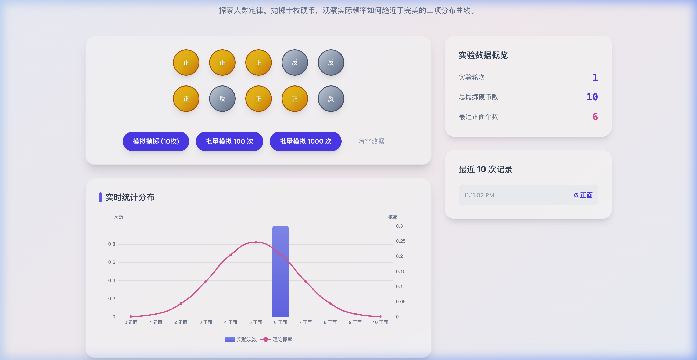
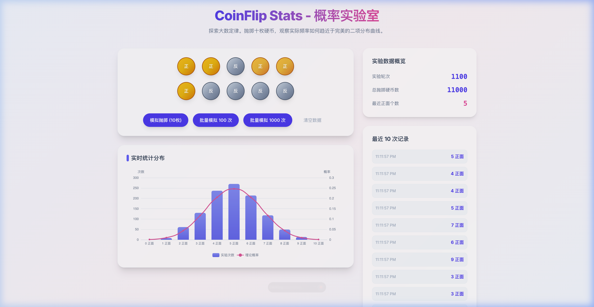

# CoinFlip Stats - 概率实验室

[English](#english) | [中文](#chinese)

---

<a name="chinese"></a>

## 中文

**CoinFlip Stats** 是一个专为大学开放日、科普展览和课堂教学设计的**概率学互动可视化工具**。通过模拟抛掷硬币的过程，帮助用户直观理解**大数定律 (Law of Large Numbers)** 和 **二项分布 (Binomial Distribution)**。

### 功能特性

- **单次模拟 (10枚)** — 带有 3D 物理翻转动画 (GSAP)，每轮展示 10 枚硬币的正反结果
- **批量模拟 (100次 / 1000次)** — 瞬间完成大规模实验，动画展示最后一轮的抛掷结果
- **实时统计分布图** — ECharts 动态柱状图 + 理论正态分布曲线叠加
- **实验历史记录** — 最近 10 轮实验数据实时展示
- **一键清空** — 重置所有数据，硬币回到中立 "?" 状态

### 项目截图

|                      初始状态                       |                     单次抛掷                      |
| :-------------------------------------------------: | :-----------------------------------------------: |
|  |  |

|                 批量模拟 & 统计分布                  |
| :--------------------------------------------------: |
|  |

### 快速开始

```bash
# 克隆仓库
git clone https://github.com/howtousellm/coin-flip.git
cd coin-flip

# 安装依赖
npm install

# 启动开发服务器
npm run dev

# 构建生产版本
npm run build
```

### 技术栈

| 技术         | 用途                       |
| ------------ | -------------------------- |
| Vue 3        | 前端框架 (Composition API) |
| Vite         | 构建工具                   |
| Tailwind CSS | UI 样式                    |
| ECharts      | 统计图表                   |
| GSAP         | 3D 翻转动画                |

### 部署

本项目使用 **Vercel** 部署，框架选择 **Vite**，零配置即可部署。

---

<br/>

<a name="english"></a>

## English

**CoinFlip Stats** is an interactive probability visualization tool designed for university open days, science exhibitions, and classroom teaching. It simulates coin flips to help users intuitively understand the **Law of Large Numbers** and the **Binomial Distribution**.

### Features

- **Single Simulation (10 Coins)** — Realistic 3D flip animation powered by GSAP
- **Batch Simulation (100x / 1000x)** — Instant large-scale experiments with animated final results
- **Real-time Distribution Chart** — Dynamic bar chart with theoretical normal curve overlay (ECharts)
- **Experiment History** — Live display of the last 10 rounds
- **One-click Reset** — Clear all data, coins return to neutral "?" state

### Screenshots

|                      Initial State                       |                     Single Flip                      |
| :------------------------------------------------------: | :--------------------------------------------------: |
|  |  |

|                Batch Simulation & Statistics                 |
| :----------------------------------------------------------: |
|  |

### Quick Start

```bash
# Clone the repository
git clone https://github.com/howtousellm/coin-flip.git
cd coin-flip

# Install dependencies
npm install

# Start the development server
npm run dev

# Build for production
npm run build
```

### Tech Stack

| Technology   | Purpose                              |
| ------------ | ------------------------------------ |
| Vue 3        | Frontend framework (Composition API) |
| Vite         | Build tool                           |
| Tailwind CSS | Styling                              |
| ECharts      | Statistical charts                   |
| GSAP         | 3D flip animations                   |

### Deployment

This project is deployed on **Vercel** using the **Vite** framework preset — zero configuration needed.

---

## License

MIT
